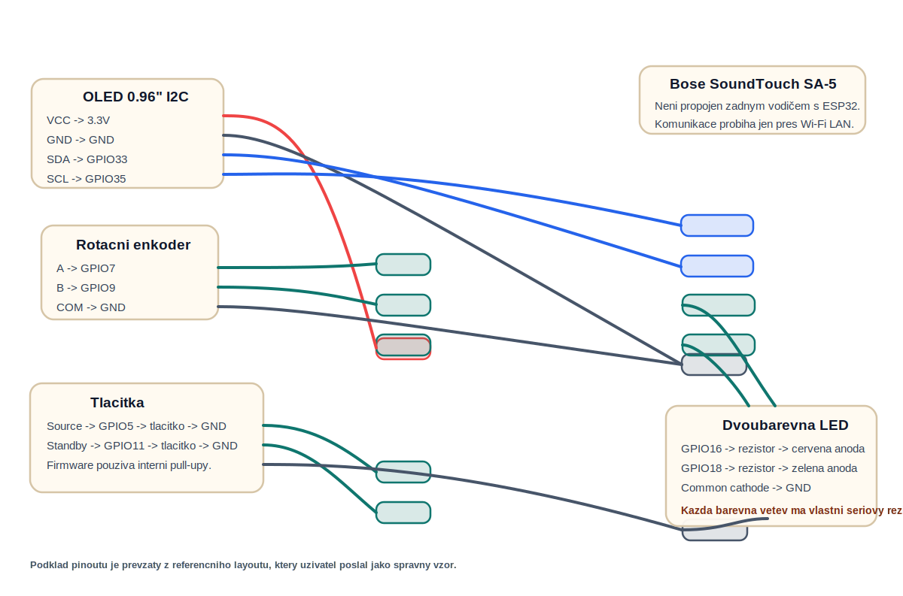

# Zapojení a spojení vodičů

Tento dokument popisuje elektrické zapojení `v1` prototypu. Výchozí referenční deska je `LOLIN/Wemos S2 Mini`. Bose zesilovač se k `ESP32` nepřipojuje žádným vodičem. Komunikace s `SA-5` probíhá výhradně po `Wi‑Fi`.

## Cely pinout a schema



Obrazek ukazuje cely pinout `LOLIN/Wemos S2 Mini`. Jen u pinu pouzitych v tomto projektu je dopsane konkretni zapojeni `OLED`, enkoderu, tlacitek a dvoubarevne LED.

## Základní princip

- `ESP32` čte lokální ovládací prvky
- `ESP32` zobrazuje stav na `OLED`
- `ESP32` posílá příkazy do `Bose SA-5` přes síť

To znamená, že na stole nebo v krabici existují jen tyto elektrické části:

- `ESP32` vývojová deska
- `OLED SSD1306 128x64 I2C`
- rotační enkodér
- tlačítko `Source`
- tlačítko `Standby`
- dvoubarevná LED `red/green` nebo podsvícené tlačítko se dvěma LED větvemi

## Pin mapa

Výchozí piny jsou definované v [PinConfig.h](/Users/peny/Development/Projects/boser-remote-control/include/PinConfig.h).

| Funkce | ESP32 pin | Poznámka |
|---|---:|---|
| OLED `SDA` | `GPIO33` | `I2C` data |
| OLED `SCL` | `GPIO35` | `I2C` clock |
| Encoder `A` | `GPIO7` | kvadraturní vstup |
| Encoder `B` | `GPIO9` | kvadraturní vstup |
| Tlačítko `Source` | `GPIO5` | aktivní v `LOW` |
| Tlačítko `Standby` | `GPIO11` | aktivní v `LOW`, zároveň servisní hold při bootu |
| LED `Red` | `GPIO16` | výstup pro červenou větev |
| LED `Green` | `GPIO18` | výstup pro zelenou větev |

## Napájení

### Varianta s `LOLIN/Wemos S2 Mini`

- `ESP32` napájet z `USB 5 V`
- `OLED` napájet z `3.3 V` desky
- tlačítka a enkodér jsou pasivní vstupy proti `GND`

### Důležité

- nepřivádět `5 V` přímo na `GPIO`
- pokud má konkrétní `OLED` modul jen `5 V` logiku, je nutné ověřit kompatibilitu s `3.3 V`
- společná zem `GND` musí být propojena mezi `ESP32`, `OLED`, enkodérem a tlačítky

## Zapojení vodičů

### OLED `SSD1306 I2C`

| OLED pin | Připojit na |
|---|---|
| `VCC` | `3.3 V` |
| `GND` | `GND` |
| `SDA` | `GPIO33` |
| `SCL` | `GPIO35` |

## Rotační enkodér

Typicky má piny `A`, `B`, `COM` a někdy i vestavěný stisk `SW`.

| Encoder pin | Připojit na |
|---|---|
| `A` | `GPIO7` |
| `B` | `GPIO9` |
| `COM` | `GND` |
| `SW` | nezapojeno v `v1` |

Firmware používá interní pull-upy, takže není nutné přidávat externí rezistory pro běžný mechanický enkodér.

## Tlačítka

Každé tlačítko je zapojené jako jednoduchý spínač proti zemi.

| Tlačítko | Jeden kontakt | Druhý kontakt |
|---|---|---|
| `Source` | `GPIO5` | `GND` |
| `Standby` | `GPIO11` | `GND` |

Firmware používá `INPUT_PULLUP`, takže tlačítko je v klidu `HIGH` a po stisku přejde do `LOW`.

## Dvoubarevná LED

Výchozí firmware počítá se dvěma samostatně řízenými LED větvemi.

| LED kontakt | Připojit na |
|---|---|
| `Red` | `GPIO16` -> samostatny seriovy rezistor -> cervena anoda LED |
| `Green` | `GPIO18` -> samostatny seriovy rezistor -> zelena anoda LED |
| `Common` | `GND` pro common-cathode variantu |

Poznámka:

- firmware má výchozí logiku `active HIGH`
- pokud použiješ common-anode LED nebo jiný aktivní stav, změň `POWER_LED_ACTIVE_HIGH` v [PinConfig.h](/Users/peny/Development/Projects/boser-remote-control/include/PinConfig.h)
- kazda LED vetev musi mit vlastni seriovy proudovy rezistor
- rezistor patri mezi `GPIO` a prislusny barevny pin LED, ne jen nekam na spolecnou vetev
- typicky pouzij `220R` az `1k`, pro prototyp rozumne treba `330R`

## Jednoduché blokové schéma

```text
                 +----------------------+
                 |   Bose SoundTouch    |
                 |       SA-5           |
                 |   Wi-Fi only link    |
                 +----------^-----------+
                            |
                         Wi-Fi LAN
                            |
+--------------------------------------------------+
|                      ESP32                       |
|                                                  |
|  GPIO33 <------ SDA -------- OLED 128x64         |
|  GPIO35 <------ SCL -------- OLED 128x64         |
|  3V3    ------> VCC -------- OLED                |
|  GND    ------> GND -------- OLED                |
|                                                  |
|  GPIO7  <------ A ---------- Encoder             |
|  GPIO9  <------ B ---------- Encoder             |
|  GND    ------> COM -------- Encoder             |
|                                                  |
|  GPIO5  <------ Source button ---> GND           |
|  GPIO11 <------ Standby button --> GND           |
|  GPIO16 ------> [330R] --> Red LED anoda        |
|  GPIO18 ------> [330R] --> Green LED anoda      |
|  GND    ------> Common cathode LED              |
|                                                  |
+--------------------------------------------------+
```

## Doporučení pro reálný spoj nebo krabičku

- vést `I2C` vodiče co nejkratší
- tlačítka a enkodér připojit stíněně nebo aspoň čistě vedenými vodiči, pokud budou delší
- pokud bude zařízení v kovové krabici, ověřit kvalitu `Wi‑Fi`
- `ESP32` umístit tak, aby anténa nebyla zakrytá kovem

## Co není součást zapojení `v1`

- žádné relé pro odpojení napájení Bose
- žádný analogový audiovýstup z `ESP32`
- žádné připojení na `AUX` konektory Bose
- žádný fyzický zásah do elektroniky `SA-5`
